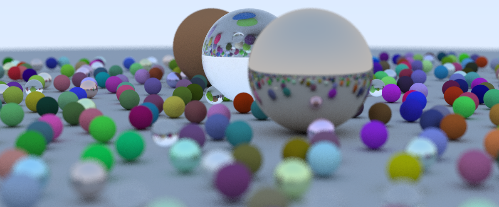

# rust-ray
Rust implementation of a simple ray tracer. Based from the book 'Ray Tracing in One Weekend' by Peter Shirley. 

Several additional features have been added to the ray-tracer presented in the book. 

- Emissive materials have been added and which requires clamping the maximum pixel intensity (no HDR support).
- Ray-triangle intersections are now possible, and custom meshes are able to be imported in the OBJ format. 
- Algorithm parallelisation with rayon.
